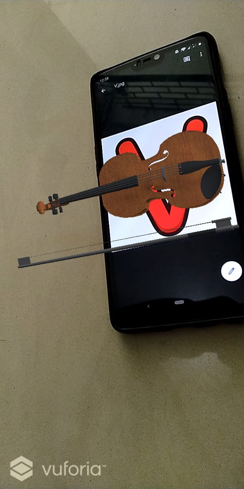
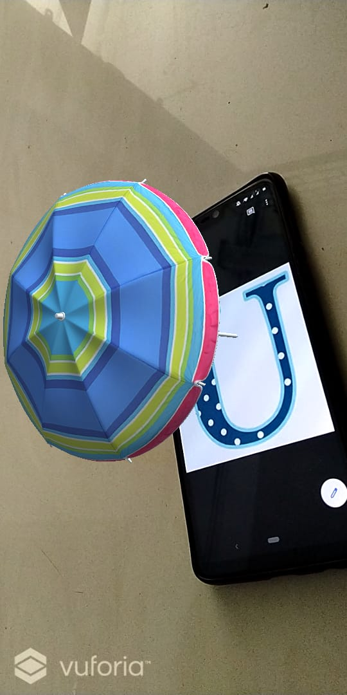
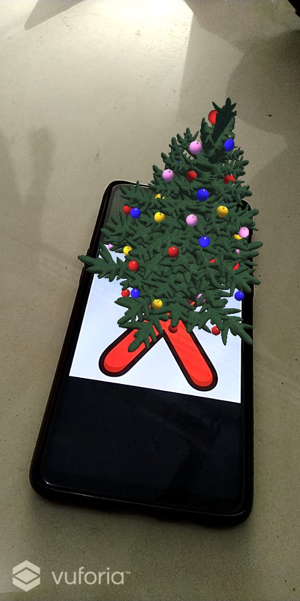
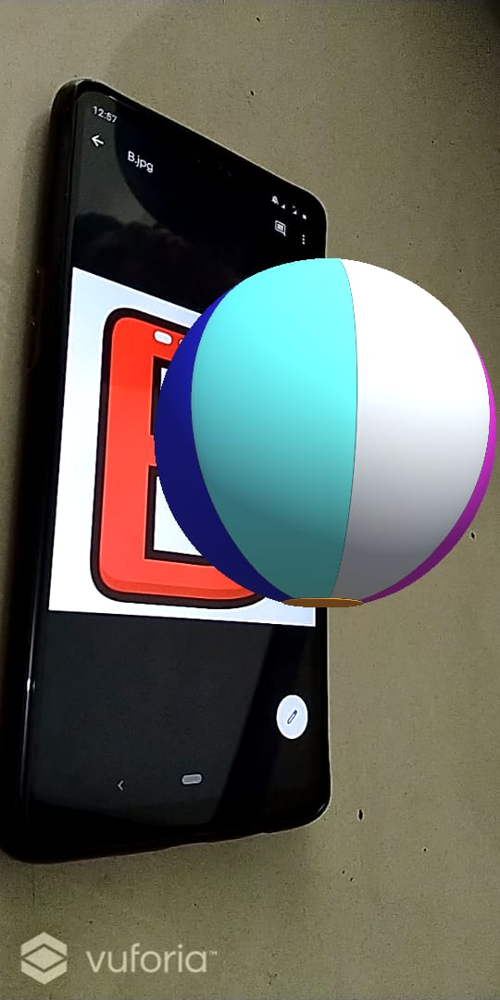
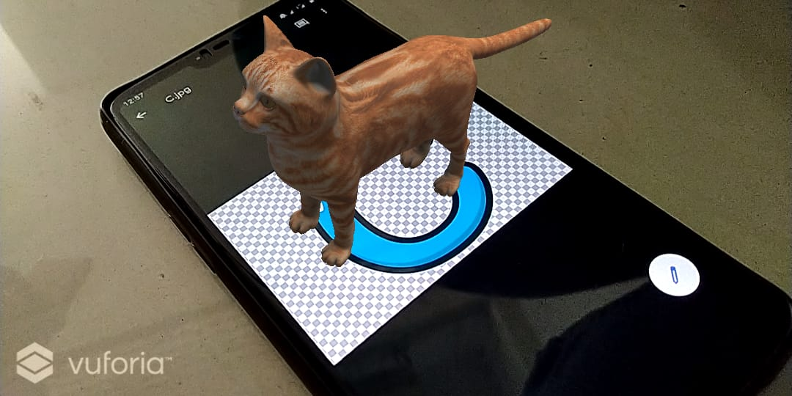

# AR-KJSCE-HACK
FUN LEARNING ALPHABETS APP using  Augmented Reality 
Application is a funway to learn alphabets for toddlers and school children using smartrphones at home.
The phone can point the camera towards the flash cards(given along) and then learn about the alphabet to which the camera is pointing.
Steps to Install the application on Android devices:
1. Download the apk file "AR-AlphaCards.apk" on your android device.
The apk file is attached with the github repository.
Intsall the application on your phone.

After Installation, point the camera to the images given along to have objects on your screen for different alphabets.

##### Demo

 

